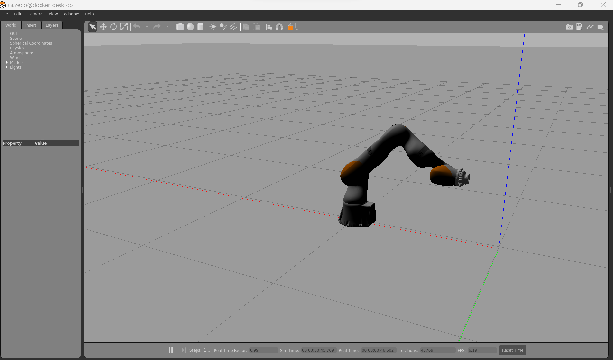

# PlannerGAN
PlannerGAN


# Commands

Outside of Docker Setup
```shell 
mkdir -p PlannerGAN_ws/src
git clone https://github.com/ICube-Robotics/iiwa_ros2.git
git clone https://github.com/jasonjabbour/PlannerGAN.git
```

Inside of the Docker
```shell

# Go back to the root of your workspace
cd /tmp/PlannerGAN_ws 

vcs import src < src/iiwa_ros2/iiwa_ros2.repos
rosdep install --ignore-src --from-paths . -y -r
colcon build --cmake-args -DCMAKE_BUILD_TYPE=Release --symlink-install
source install/setup.bash

source /usr/share/gazebo/setup.sh
export GAZEBO_MODEL_PATH=$GAZEBO_MODEL_PATH:/tmp/PlannerGAN_ws/src/iiwa_ros2
ros2 launch iiwa_simulation iiwa_gazebo.launch.py use_sim:="true"

```

